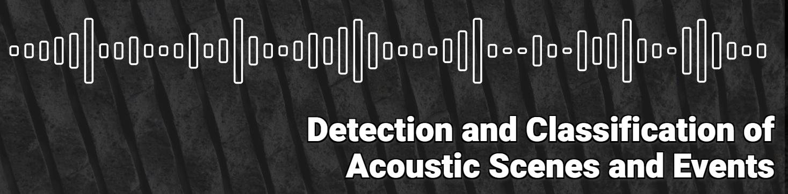

# DCASE-2023-Workshop Papers

The proceedings of the 8th Workshop on Detection and Classification of Acoustic Scenes and Events, DCASE 2023, can be found at this link [DCASE 2023 Workshop on Detection and Classification of Acoustic Scenes and Events](https://trepo.tuni.fi/bitstream/handle/10024/152310/978-952-03-3171-9.pdf?sequence=2&isAllowed=y). 

<!--

-->

## Papers

| **ID** | **Title** | **Repo** | **PDF** | **Abstract**                                                                                                                                                                                                                                                                                                                                                                                                                                                                                                                                                                                                                                                                                                                                                                                                                                                                                                                                                                                                                                                                                                                                                                                                   |
| ------ | ----------| :------: |:-------:|----------------------------------------------------------------------------------------------------------------------------------------------------------------------------------------------------------------------------------------------------------------------------------------------------------------------------------------------------------------------------------------------------------------------------------------------------------------------------------------------------------------------------------------------------------------------------------------------------------------------------------------------------------------------------------------------------------------------------------------------------------------------------------------------------------------------------------------------------------------------------------------------------------------------------------------------------------------------------------------------------------------------------------------------------------------------------------------------------------------------------------------------------------------------------------------------------------------| 
| 1 | Sound Event Classification with Object-Based Labels | :heavy_minus_sign: |  | 

Show
 
 Availability of audio-visual datasets and increase of computational resources have made possible the use of deep learning techniques that exploit the relationship between audio and video. In this paper, we present an approach that makes use of pretrained models for object detection to label audio clips based on objects that are expected to make sound. The study consists of performing object detection for four target classes belonging to vehicle category and training sound classifiers in supervised way using the resulting labels. We conclude that object detection is a useful alternative for labeling audio-visual material for audio classification, with substantial improvements in different datasets. Results show that even for data provided with reference audio labels, labeling through video object detection can identify additional, non-annotated acoustic events, thus improving the quality of the labels in existing datasets. This promotes exploitation of video content not only as an alternative, but also to complement the available label information.

 |
| 2 | Learning in the Wild: Bioacoustics Few Shot Learning Without Using a Training Set | :heavy_minus_sign: |  | 

Show
 
 Few-shot learning is a machine learning approach in which a pre-trained model is re-trained for new categories with just a few examples. This strategy results very convenient for problems with a dynamic number of categories as typically happens in acoustic data. The purpose of this paper is to explore the possibility of skipping this pre-training process and using as training data only the five first shots of an audio file together with the silence between them. For the experimental evaluation, data belonging to the Validation set of Task 5 DCASE Challenge 2023 is used, purposely neglecting the Training set. This challenge consists of detecting animal species using only five positive examples. In this exploratory work, three learning methods have been compared: a ResNet architecture with a prototypical loss, a ProtoNet and an XGBoost classifier. In all cases, spectrograms with different transformations are used as inputs. Obtained results are evaluated per audio file, enabling the obtention of particular conclusions about different animal species. While the detection for some species presents encouraging results using only these first 5-shots as training data, all the tested algorithms are unable to successfully learn how to properly detect the blackbird sounds of the validation dataset.

 |
| 3 | Multi-Resolution Conformer for Sound Event Detection: Analysis and Optimization | :heavy_minus_sign: |  | 

Show
 
 The Conformer architecture has achieved state-of-the-art results in several tasks, including automatic speech recognition and automatic speaker verification. However, its utilization in sound event detection and in particular in the DCASE Challenge Task 4 has been limited despite winning the 2020 edition. Although the Conformer architecture may not excel in accurately localizing sound events, it shows promising potential in minimizing confusion between different classes. Therefore, in this paper we propose a Conformer optimization to enhance the second Polyphonic Sound Detection Score (PSDS) scenario defined for the DCASE 2023 Task 4A. With the aim of maximizing its classification properties, we have employed recently proposed methods such as Frequency Dynamic Convolutions in addition to our multi-resolution approach, which allow us to analyse its behaviour over different time-frequency resolution points. Furthermore, our Conformer systems are compared with multi-resolution models based on Convolutional Recurrent Neural Networks (CRNNs) to evaluate the respective benefits of each architecture in relation to the two proposed scenarios for the PSDS and the different time-frequency resolution points defined. These systems were submitted as our participation in the DCASE 2023 Task 4A, in which our Conformer system obtained a PSDS2 value of 0.728, achieving one of the highest scores for this scenario among systems trained without external resources.

 |
| 4 | Foley Sound Synthesis at the DCASE 2023 Challenge | :heavy_minus_sign: |  | 

Show
 
The addition of Foley sound effects during post-production is a common technique used to enhance the perceived acoustic properties of multimedia content. Traditionally, Foley sound has been produced by human Foley artists, which involves manual recording and mixing of sound. However, recent advances in sound synthesis and generative models have generated interest in machine-assisted or automatic Foley synthesis techniques. To promote further research in this area, we have organized a challenge in DCASE 2023: Task 7 - Foley Sound Synthesis. Our challenge aims to provide a standardized evaluation framework that is both rigorous and efficient, allowing for the evaluation of different Foley synthesis systems. We received 17 submissions, and performed both objective and subjective evaluation to rank them according to three criteria: audio quality, fit-to-category, and diversity. Through this challenge, we hope to encourage active participation from the research community and advance the state-of-the-art in automatic Foley synthesis. In this paper, we provide a detailed overview of the Foley sound synthesis challenge, including task definition, dataset, baseline, evaluation scheme and criteria, challenge result, and discussion.

 |
| 5 | STELIN-US: A Spatio-Temporally Linked Neighborhood Urban Sound Database |   |  | 

Show
 
Automated acoustic understanding, e.g., sound event detection and acoustic scene recognition, is an important research direction enabling numerous modern technologies. Although there is a wealth of corpora, most, if not all, include acoustic samples of scenes/events in isolation without considering their inter-connectivity with locations nearby in a neighborhood. Within a connected neighborhood, the temporal continuity and regional limitation (sound-location dependency) at distinct locations creates non-iid acoustics samples at each site across spatial-temporal dimensions. To our best knowledge, none of the previous data sources takes on this particular angle. In this work, we present a novel dataset, Spatio-temporally Linked Neighborhood Urban Sound (STeLiN-US) database. The dataset is semi-synthesized, that is, each sample is generated by leveraging diverse sets of real urban sounds with crawled information of real-world user behaviors over time. This method helps create realistic large-scale dataset, and we further evaluate through perceptual listening test. This neighborhood-based data generation opens up novel opportunities to advance user-centered applications with automated acoustic understanding. For example, to develop real-world technology to model a user's speech data over a day, one can imagine utilizing this dataset as user's speech samples would modulate by diverse sources of acoustics surrounding linked across sites and temporally by natural behavior dynamics at each location over time.

 |
| 6 | Foley Sound Synthesis Based on Generative Adversarial Networks Using Oneself-Conditioned Contrastive Learning | :heavy_minus_sign: |  | 

Show
 
The creation of sound effects, such as foley sounds, for radio or film has traditionally relied on the expertise of skilled professionals. However, synthesizing these sounds automatically without expert intervention presents significant challenge. Particularly, when the available data is limited, this challenge becomes even more compounded. This often leads to a lack of diversity in the generated data. In this paper, we propose effective GAN frameworks, O2C-GAN and OC-SupConGAN for foley sound synthesis in this situation. The proposed frameworks use a new learning method, oneself-conditioned contrastive learning (OCC learning), to solve problems encountered in small dataset. The OCC learning is a method that aims to expand the diversity of data while preserving the inherent attributes of each class within the data. Experiments show that the proposed framework outperforms baseline schemes, ranking 2nd in DCASE2023-T7 Track B with a FAD score of 5.023 on the evaluation set.

 |
| 7 | Description and Discussion on DCASE 2023 Challenge Task 2: First-Shot Unsupervised Anomalous Sound Detection for Machine Condition Monitoring | :heavy_minus_sign: |  | 

Show
 
We present the task description of the Detection and Classification of Acoustic Scenes and Events (DCASE) 2023 Challenge Task 2: “First-shot unsupervised anomalous sound detection (ASD) for machine condition monitoring”. The main goal is to enable rapid deployment of ASD systems for new kinds of machines without the need for hyperparameter tuning. In the past ASD tasks, developed methods tuned hyperparameters for each machine type, as the development and evaluation datasets had the same machine types. However, collecting normal and anomalous data as the development dataset can be infeasible in practice. In 2023 Task 2, we focus on solving first-shot problem, which is the challenge of training a model on a completely novel machine type. Specifically, (i) each machine type has only one section (a subset of machine type) and (ii) machine types in the development and evaluation datasets are completely different. Analysis of 86 submissions from 23 teams revealed that keys to outperform baselines were: 1) sampling techniques for dealing with class imbalances across different domains and attributes, 2) generation of synthetic samples for robust detection, and 3) use of multiple large pre-trained models to extract meaningful embeddings for the anomaly detector.

 |
| 8 | Post-Processing Independent Evaluation of Sound Event Detection Systems |  |  | 

Show
 
 Due to the high variation in the application requirements of sound event detection (SED) systems, it is not sufficient to evaluate systems only in a single operating mode. Therefore, the community recently adopted the polyphonic sound detection score (PSDS) as an evaluation metric, which is the normalized area under the PSD receiver operating characteristic (PSD-ROC). It summarizes the system performance over a range of operating modes resulting from varying the decision threshold that is used to translate the system output scores into a binary detection output. Hence, it provides a more complete picture of the overall system behavior and is less biased by specific threshold tuning. However, besides the decision threshold there is also the post-processing that can be changed to enter another operating mode. In this paper we propose the post-processing independent PSDS (piPSDS) as a generalization of the PSDS. Here, the post-processing independent PSD-ROC includes operating points from varying post-processings with varying decision thresholds. Thus, it summarizes even more operating modes of an SED system and allows for system comparison without the need of implementing a post-processing and without a bias due to different post-processings. While piPSDS can in principle combine different types of post-processing, we here, as a first step, present median filter independent PSDS (miPSDS) results for this year’s DCASE Challenge Task4a systems. Source code is publicly available in our sed_scores_eval package.

 |
| 9 | ToyADMOS2+: New Toyadmos Data and Benchmark Results of the First-Shot Anomalous Sound Event Detection Baseline | |  | 

Show
 
This paper introduces the newly recorded ToyADMOS dataset for the DCASE 2023 Challenge Task 2, First-shot anomalous sound detection for machine condition monitoring (DCASE2023T2). New machine types, such as ToyDrone, ToyNscale, Vacuum, and ToyTank, were newly recorded as a part of the Additional training and Evaluation datasets. This paper also shows benchmark results of the First-shot baseline implementation (with simple autoencoder and selective Mahalanobis modes) on the DCASE2023T2 Evaluation dataset and the previous DCASE Challenge Task 2 datasets in 2020, 2021, and 2022, compared with the baselines of those years.

 |
| 10 | Evaluating Classification Systems Against Soft Labels with Fuzzy Precision and Recall    | :heavy_minus_sign: |  | 

Show
 
Classification systems are normally trained by minimizing the cross-entropy between system outputs and reference labels, which makes the Kullback-Leibler divergence a natural choice for measuring how closely the system can follow the data. Precision and recall provide another perspective for measuring the performance of a classification system. Non-binary references can arise from various sources, and it is often beneficial to use the soft labels for training instead of the binarized data. However, the existing definitions for precision and recall require binary reference labels, and binarizing the data can cause erroneous interpretations. We present a novel method to calculate precision, recall and F-score without quantizing the data. The proposed metrics extend the well established metrics as the definitions coincide when used with binary labels. To understand the behavior of the metrics we show simple example cases and an evaluation of different sound event detection models trained on real data with soft labels.

 |
| 11 | META-SELD: Meta-Learning for Fast Adaptation to the New Environment in Sound Event Localization and Detection | :heavy_minus_sign: |  | 

Show
 
For learning-based sound event localization and detection (SELD) methods, different acoustic environments in training and test sets may result in large performance differences in validation and evaluation stages. Different environments, such as different sizes of rooms, different reverberation times, and different background noise, may be the reason for a learning-based system to fail. On the other hand, acquiring annotated spatial sound event samples, which include onset and offset time stamps, class types of sound events, and direction-of-arrival (DOA) of sound sources is very expensive. In addition, deploying a SELD system in a new environment often poses challenges due to time-consuming training and fine-tuning processes. To address these issues, we propose Meta-SELD, which applies meta-learning methods to achieve fast adaptation to new environments. More specifically, based on Model Agnostic Meta-Learning (MAML), the proposed Meta-SELD aims at finding good meta-initialized parameters to adapt to new environments only with a small number of samples and parameter updating iterations. We can then adapt the meta-trained SELD model to unseen environments quickly. Our experiments compare fine-tuning methods from pre-trained SELD models with our Meta-SELD on Sony-TAU Realistic Spatial Soundscapes 2023 (STARSSS23) dataset. The evaluation results demonstrate the effectiveness of Meta-SELD adapting to new environments.

 |
| 12 | Leveraging Geometrical Acoustic Simulations of Spatial Room Impulse Responses for Improved Sound Event Detection and Localization |  |  | 

Show
 
As deeper and more complex models are developed for the task of sound event localization and detection (SELD), the demand for annotated spatial audio data continues to increase. Annotating field recordings with 360^{\circ} video takes many hours from trained annotators, while recording events within motion-tracked laboratories are bounded by cost and expertise. Because of this, localization models rely on a relatively limited amount of spatial audio data in the form of spatial room impulse response (SRIR) datasets, which limits the progress of increasingly deep neural network based approaches. In this work, we demonstrate that simulated geometrical acoustics can provide an appealing solution to this problem. We use simulated geometrical acoustics to generate a novel SRIR dataset that can train a SELD model to provide similar performance to that of a real SRIR dataset. Furthermore, we demonstrate using simulated data to augment existing datasets, improving on benchmarks set by state of the art SELD models. We explore the potential and limitations of geometric acoustic simulation for localization and event detection. We also propose further studies to verify the limitations of this method, as well as further methods to generate synthetic data for SELD tasks without the need to record more data.

 |
| 13 | Speech Obfuscation in Mel Spectra That Allows for Centralised Annotation and Classification of Sound Events | :heavy_minus_sign: |  | 

Show
 
Nowadays, computerised Sound Event Classification (SEC) aids in several applications, e.g. monitoring domestic events in smart homes. SEC model development typically requires data collected from a diverse set of remote locations. However, this data could disclose sensitive information about uttered speech that might have been present during the acquisition. This makes automated data acquisition at remote locations difficult in practice. In this work, three data preprocessing techniques are investigated that obstruct recognising semantics in speech, but retain the required information in the data for annotating sound events and SEC model development. At the remote location, the data are first preprocessed before transferring to a central place. At the central location, speech should not be interpretable anymore, while still having the opportunity to annotate data with relevant sound event labels. For this purpose, starting from a log-mel representation of the sound signals, three speech obfuscation techniques are assessed: 1) calculating a moving average of the log-mel spectra, 2) sampling a few of the most energetic log-mel spectra and 3) shredding the log-mel spectra. Both intelligibility and SEC experiments were carried out.

 |
| 14 | FALL-E: A Foley Sound Synthesis Model and Strategies | :heavy_minus_sign: |  | 

Show
 
This paper introduces FALL-E, a foley synthesis system and its training/inference strategies. The FALL-E model employs a cascaded approach comprising low-resolution spectrogram generation, spectrogram super-resolution, and a vocoder. We trained every sound-related model from scratch using our extensive datasets, and utilized a pre-trained language model. We conditioned the model with dataset-specific texts, enabling it to learn sound quality and recording environment based on text input. Moreover, we leveraged external language models to improve text descriptions of our datasets and performed prompt engineering for quality, coherence, and diversity. FALL-E was evaluated by an objective measure as well as listening tests in the DCASE 2023 challenge Task 7. The submission achieved the second place on average, while achieving the best score for diversity, second place for audio quality, and third place for class fitness.

 |
| 15 | Label Filtering-Based Self-Learning for Sound Event Detection Using Frequency Dynamic Convolution with Large Kernel Attention | :heavy_minus_sign: |  | 

Show
 
This paper proposes a convolutional recurrent neural network (CRNN)-based sound event detection (SED) model. The proposed model utilizes frequency dynamic convolution (FDY) with a large kernel attention (LKA) for convolution operations within the CRNN. This is designed to effectively capture time-frequency patterns and long-term dependencies for non-stationary audio events. In addition, we concatenate a pre-trained bidirectional encoder representation from audio transformers (BEATs) embedding with the output of FDY–LKA. This provides the FDY-based feature maps with semantic information. Given the limited labeled data condition of the DCASE Challenge dataset, we first employ the mean-teacher-based semi-supervised learning. Then, we propose label filtering-based self-learning for audio event data selection, when their pseudo labels predicted from the mean-teacher model are strong correlated with given weakly labels. This strategy applies weakly labeled and unlabeled data, and then extends to the AudioSet. We evaluate its performance of the proposed SED model on DCASE 2023 Challenge Task 4A, measuring the F1-score and polyphonic sound detection scores, namely PSDS1 and PSDS2. The results indicate that the proposed CRNN-based model with FDY–LKA improves the F1-score, PSDS1, and PSDS2 in comparison to the baseline for DCASE 2023 Challenge Task 4A. When we apply the BEATs embedding via average pooling to both the baseline and the proposed model, we find that the performance of the proposed model significantly outperforms the baseline, with an F1-score of 6.2%, a PSDS1 score of 0.055, and a PSDS2 score of 0.021. Consequently, our model is ranked first in the DCASE 2023 Challenge Task 4A evaluation for a single model track, and second for an ensemble model.

 |
| 16 | Improving Automated Audio Captioning Fluency Through Data Augmentation and Ensemble Selection |  :heavy_minus_sign: |  | 

Show
 
Automated audio captioning is a task of generating descriptions corresponding to audio clips. The model typically consists of a pre-training and fine-tuning process, with additional utilization of reinforcement learning techniques. While reinforcement learning enhances the evaluation metrics for captions, it has the drawback of potentially lowering the quality of the captions, such as incomplete sentence structures or repetitive words. In this study, we propose an ensemble selection technique that combines models before and after reinforcement learning to improve evaluation metrics while maintaining caption quality. Furthermore, we apply several data augmentation techniques to complement the characteristics of WavCaps, which predominantly consists of single events, and enhance the model's generalization abilities. In particular, proposed approaches can reach impressive scores both an existing metric SPIDE_{r}, and a new fluency metric SPIDE_{r}-FL, 0.344 and 0.315, respectively. This resulted in a 2nd place ranking in DCASE 2023 task 6a, while the baseline system achieved SPIDE_{r} of 0.271 and SPIDE_{r}-FL of 0.264.

 |
| 17 | Weakly-Supervised Automated Audio Captioning via Text Only Training |   |  | 

Show
 
In recent years, datasets of paired audio and captions have enabled remarkable success in automatically generating descriptions for audio clips, namely Automated Audio Captioning (AAC). However, it is labor-intensive and time-consuming to collect a sufficient number of paired audio and captions. Motivated by the recent advances in Contrastive Language-Audio Pretraining (CLAP), we propose a weakly-supervised approach to train an AAC model assuming only text data and a pre-trained CLAP model, alleviating the need for paired target data. Our approach leverages the similarity between audio and text embeddings in CLAP. During training, we learn to reconstruct the text from the CLAP text embedding, and during inference, we decode using the audio embeddings. To mitigate the modality gap between the audio and text embeddings we employ strategies to bridge the gap during training and inference stages. We evaluate our proposed method on Clotho and AudioCaps datasets demonstrating its ability to achieve up to ~83% of the performance attained by fully supervised approaches trained on paired target data.

 |
| 18 | Killing Two Birds with One Stone: Can an Audio Captioning System Also Be Used for Audio-Text Retrieval? |  :heavy_minus_sign: |  | 

Show
 
Automated Audio Captioning (AAC) aims to develop systems capable of describing an audio recording using a textual sentence. In contrast, Audio-Text Retrieval (ATR) systems seek to find the best matching audio recording(s) for a given textual query (Text-to-Audio) or vice versa (Audio-to-Text). These tasks require different types of systems: AAC employs a sequence-to-sequence model, while ATR utilizes a ranking model that compares audio and text representations within a shared projection subspace. However, this work investigates the relationship between AAC and ATR by exploring the ATR capabilities of an unmodified AAC system, without fine-tuning for the new task. Our AAC system consists of an audio encoder (ConvNeXt-Tiny) trained on AudioSet for audio tagging, and a transformer decoder responsible for generating sentences. For AAC, it achieves a high SPIDEr-FL score of 0.298 on Clotho and 0.472 on AudioCaps on average. For ATR, we propose using the standard Cross-Entropy loss values obtained for any audio/caption pair. Experimental results on the Clotho and AudioCaps datasets demonstrate decent recall values using this simple approach. For instance, we obtained a Text-to-Audio R@1 value of 0.382 for AudioCaps, which is above the current state-of-the-art method without external data. Interestingly, we observe that normalizing the loss values was necessary for Audio-to-Text retrieval.

 |
| 19 | Few Shot Bioacoustic Detection Boosting with Finetuning Strategy Using Negative-Based Prototypical Learning | :heavy_minus_sign: |  | 

Show
 
Sound event detection involves the identification and temporal localization of sound events within audio recordings. Bioacoustic sound event detection specifically targets animal vocalizations, which necessitate substantial time and resources for manual annotation of temporal boundaries. This paper aims to address the challenges associated with bioacoustic sound event detection by proposing a novel prototypical learning framework. Our approach fuses contrastive learning and prototypical learning to use the limited amount of dataset at its utmost. Further, our framework leverages finetuning strategy with a novel loss function to develop a robust framework. Experimental results on a benchmark dataset demonstrate the effectiveness of our proposed method in accurately detecting and localizing bioacoustic sound events, improving the F1 score from 29.59% to 83.08%.

 |
| 20 | Masked Modeling Duo Vision Transformer with Multi-Layer Feature Fusion on Respiratory Sound Classification |   |  | 

Show
 
Respiratory sounds are significant relevant indicators for respi- ratory health and conditions. Classifying the respiratory sounds of patients can assist doctors’ diagnosis of lung diseases. For this pur- pose, many deep learning-based automatic analysis methods have been developed. However, it is still challenging due to the lim- ited medical sound datasets. In this study, we apply a pre-trained Vision Transformer (ViT) based model from the Masked Model- ing Duo (M2D) framework for this task. While the M2D ViT pre- trained model provides effective features, we think combining fea- tures from different layers can improve the performance in this task. We propose a multi-layer feature fusion method using learnable layer-wise weights and validate its effectiveness in experiments and an analysis of pre-trained model layers. Our approach achieves the best ICBHI score of 60.68, 2.39 higher than the previous state-of- the-art method.

 |
| 21 | Efficient Evaluation Algorithms for Sound Event Detection | :heavy_minus_sign: |  | 

Show
 
The prediction of a sound event detection (SED) system may be represented on a timeline by intervals whose bounds correspond to onset and offset respectively. In this context, SED evaluation requires to find all non-empty intersections between predicted and reference intervals. Denoting by M and N the number of predicted events and reference events, the time complexity of exhaustive search is O(MN). This is particularly inefficient when the acoustic scene of interest contains many events (typically above 10^3) or when the detection threshold is low. Our article presents an algorithm for pairwise intersection of intervals by performing binary search within sorted onset and offset times. Computational benchmarks on the BirdVox-full-night dataset confirms that our algorithm is significantly faster than exhaustive search. Moreover, we explain how to use this list of intersecting prediction--reference pairs for the purpose of SED evaluation: the Hopcroft-Karp algorithm guarantees an optimal bipartite matching in time O((M+N)^{3/2}) in the best case (all events are pairwise disjoint) and O((M+N)^{5/2}) in the worst case (all events overlap with each other). The solution found by Hopcroft-Karp unambiguously defines a number of true positives, false positives, and false negatives; and ultimately, information retrieval metrics such as precision, recall, and F-score.

 |
| 22 | Aggregate or Separate: Learning From Multi-Annotator Noisy Labels for Best Classification Performance | :heavy_minus_sign: |  | 

Show
 
While there is the saying of two heads are better than one, having multiple opinions brings the problem of finding a common ground. For data, multiple annotator opinions are usually aggregated into a single set of labels, regarded as the ground truth. With this ground truth, classification models can be trained in a supervised way to learn the annotated data categories. Finding a suitable aggregation for multiple annotator opinions is the topic of research in many domains. In this work we investigate the use of raw data obtained from multiple annotators with various levels of reliability, to train a model for audio classification. The model sees all the individual annotator opinions and learns the categories without the need of aggregating the information. The results show that using a fully-connected layer that models individual annotators, it is possible to leverage the data distribution and learn to classify sounds without the need for aggregation of labels.

 |
| 23 | Active Learning in Sound-Based Bearing Fault Detection | :heavy_minus_sign: |  | 

Show
 
While there is the saying of two heads are better than one, having multiple opinions brings the problem of finding a common ground. For data, multiple annotator opinions are usually aggregated into a single set of labels, regarded as the ground truth. With this ground truth, classification models can be trained in a supervised way to learn the annotated data categories. Finding a suitable aggregation for multiple annotator opinions is the topic of research in many domains. In this work we investigate the use of raw data obtained from multiple annotators with various levels of reliability, to train a model for audio classification. The model sees all the individual annotator opinions and learns the categories without the need of aggregating the information. The results show that using a fully-connected layer that models individual annotators, it is possible to leverage the data distribution and learn to classify sounds without the need for aggregation of labels.

 |
| 24 | Auditory Neural Response Inspired Sound Event Detection Based on Spectro-Temporal Receptive Field | :heavy_minus_sign: |  | 

Show
 
Sound event detection (SED) is one of tasks to automate function by human auditory system which listens and understands auditory scenes. Therefore, we were inspired to make SED recognize sound events in the way human auditory system does. Spectro-temporal receptive field (STRF), an approach to describe the relationship between perceived sound at ear and transformed neural response in the auditory cortex, is closely related to recognition of sound. In this work, we utilized STRF as a kernel of the first convolutional layer in SED model to extract neural response from input sound to make SED model similar to human auditory system. In addition, we constructed two-branched SED model named as Two Branch STRFNet (TB-STRFNet) composed of STRF branch and baseline branch. While STRF branch extracts sound event information from auditory neural response, baseline branch extracts sound event information directly from the mel spectrogram just as conventional SED models do. TB-STRFNet outperformed the DCASE baseline by 4.3% in terms of threshold-independent macro F1 score, achieving 4th rank in DCASE Challenge 2023 Task 4b. We further improved TB-STRFNet by applying frequency dynamic convolution (FDY-Conv) which also leveraged domain knowledge on acoustics. As a result, two branch model applied with FDYConv on both branches outperformed the DCASE baseline by 6.2% in terms of the same metric.

 |
| 25 | Creating a Good Teacher for Knowledge Distillation in Acoustic Scene Classification | :heavy_minus_sign: |  | 

Show
 
Knowledge Distillation (KD) is a widespread technique for compressing the knowledge of large models into more compact and efficient models. KD has proved to be highly effective in building well-performing low-complexity Acoustic Scene Classification (ASC) systems and was used in all the top-ranked submissions to this task of the annual DCASE challenge in the past three years. There is extensive research available on establishing the KD process, designing efficient student models, and forming well-performing teacher ensembles. However, less research has been conducted on investigating which teacher model attributes are beneficial for low-complexity students. In this work, we try to close this gap by studying the effects on the student's performance when using different teacher network architectures, varying the teacher model size, training them with different data augmentation methods, and applying different ensembling strategies. The results show that teacher model sizes, data augmentation methods, the ensembling strategy and the ensemble size are key factors for a well-performing student network.

 |
| 26 | Pretraining Representations for Bioacoustic Few-Shot Detection Using Supervised Contrastive Learning |   |  | 

Show
 
Deep learning has been widely used recently for sound event detection and classification. Its success is linked to the availability of sufficiently large datasets, possibly with corresponding annotations when supervised learning is considered. In bioacoustic applications, most tasks come with few labelled training data, because annotating long recordings is time consuming and costly. Therefore supervised learning is not the best suited approach to solve bioacoustic tasks. The bioacoustic community recasted the problem of sound event detection within the framework of few-shot learning, i.e. training a system with only few labeled examples. The few-shot bioacoustic sound event detection task in the DCASE challenge focuses on detecting events in long audio recordings given only five annotated examples for each class of interest. In this paper, we show that learning a rich feature extractor from scratch can be achieved by leveraging data augmentation using a supervised contrastive learning framework. We highlight the ability of this framework to transfer well for five-shot event detection on previously unseen classes in the training data. We obtain an F-score of 63.46% on the validation set and 42.7% on the test set, ranking second in the DCASE challenge. We provide an ablation study for the critical choices of data augmentation techniques as well as for the learning strategy applied on the training set.

 |
| 27 | Incremental Learning of Acoustic Scenes and Sound Events | :heavy_minus_sign: |  | 

Show
 
In this paper, we propose a method for incremental learning of two distinct tasks over time: acoustic scene classification (ASC) and audio tagging (AT). We use a simple convolutional neural network (CNN) model as an incremental learner to solve the tasks. Generally, incremental learning methods catastrophically forget the previous task when sequentially trained on a new task. To alleviate this problem, we propose independent learning and knowledge distillation (KD) between the timesteps in learning. Experiments are performed on TUT 2016/2017 dataset, containing 4 acoustic scene classes and 25 sound event classes. The proposed incremental learner first solves the ASC task with an accuracy of 94.0%. Next, it learns to solve the AT task with an F1 score of 54.4%. At the same time, its performance on the previous ASC task decreases only by 5.1 percentage points due to the additional learning of the AT task.

 |
| 28 | Frequency & Channel Attention for Computationally Efficient Sound Event Detection |   |  | 

Show
 
We explore on various attention methods on frequency and channel dimensions for sound event detection (SED) in order to enhance performance with minimal increase in computational cost while leveraging domain knowledge to address the frequency dimension of audio data. We have introduced frequency dynamic convolution (FDY conv) in a previous work to release the translational equivariance issue associated with 2D convolution on the frequency dimension of 2D audio data. Although this approach demonstrated state-of-the-art SED performance, it resulted in a model with 150% more trainable parameters. To achieve comparable SED performance with computationally efficient methods for practicality, we explore on lighter alternative attention methods. In addition, we focus on attention methods applied to frequency and channel dimensions. Joint application Squeeze-and-excitation (SE) module and time-frame frequency-wise SE (tfwSE) to apply attention on both frequency and channel dimensions shows comparable performance to SED model with FDY conv with only 2.7% more trainable parameters compared to the baseline model. In addition, we performed class-wise comparison of various attention methods to further discuss various attention methods' characteristics.

 |
| 29 | Unsupervised Domain Adaptation for the Cross-Dataset Detection of Humpback Whale Calls | :heavy_minus_sign: |  | 

Show
 
Machine learning methods, and deep networks in particular, often underperform on data which lies outside the training distribution. Changes to the data distributions (known as domain shift) are particularly prevalent in bioacoustics, where many external factors can vary between datasets, although the effects of this are often not properly considered. This paper presents a benchmark for out of distribution (OOD) performance based on the detection of humpback whales in underwater acoustic data. Several humpback whale detectors from the literature are implemented as baselines, along with our own detector based on a convolutional neural network (CNN). Then, a set of unsupervised domain adaptation (UDA) algorithms are compared. Results show that UDA can significantly improve OOD performance when few distinct sources of training data are available. However, this is not a substitute for better data, as negative transfer (where the adapted models actually perform worse) is commonly observed. On the other hand, we find that training on a variety of distinct sources of data (at least 6) is sufficient to allow models to generalise OOD, without the need for advanced UDA algorithms. This allows our model to outperform all the baseline detectors we test, despite having 10,000 times fewer parameters and 100,000 times less training data than the next-best model.

 |
| 30 | Few-Shot Bioacoustic Event Detection at the DCASE 2023 Challenge |   |  | 

Show
 
Few-shot bioacoustic event detection consists in detecting sound events of specified types, in varying soundscapes, while having access to only a few examples of the class of interest. This task ran as part of the DCASE challenge for the third time this year with an evaluation set expanded to include new animal species, and a new rule: ensemble models were no longer allowed. The 2023 few-shot task received submissions from 6 different teams with F-scores reaching as high as 63% on the evaluation set. Here we describe the task, focusing on describing the elements that differed from previous years. We also take a look back at past editions to describe how the task has evolved. Not only have the F-score results steadily improved (40% to 60% to 63%), but the type of systems proposed have also become more complex. Sound event detection systems are no longer simple variations of the baselines provided: multiple few-shot learning methodologies are still strong contenders for the task.

 |
| 31 | Advancing Natural-Language Based Audio Retrieval with Passt and Large Audio-Caption Data Sets |   |  | 

Show
 
This work presents a text-to-audio-retrieval system based on pre-trained text and spectrogram transformers. Our method projects recordings and textual descriptions into a shared audio-caption space in which related examples from different modalities are close. Through a systematic analysis, we examine how each component of the system influences retrieval performance. As a result, we identify two key components that play a crucial role in driving performance: the self-attention-based audio encoder for audio embedding and the utilization of additional human-generated and synthetic data sets during pre-training. We further experimented with augmenting ClothoV2 captions with available keywords to increase their variety; however, this only led to marginal improvements. Our system ranked first in the 2023's DCASE Challenge, and it outperforms the current state of the art on the ClothoV2 benchmark by 5.6 pp. mAP@10.

 |
| 32 | Foley Sound Synthesis with a Class-Conditioned Latent Diffusion Model | :heavy_minus_sign: |  | 

Show
 
We propose a competitive Foley sound synthesis system based on available components and fine-tuned on a target dataset. We reuse a text-to-audio pre-trained model composed of a latent diffusion model (LDM), trained on AudioCaps, a variational auto-encoder (VAE), and a vocoder. We fine-tune the LDM on the development dataset of the DCASE 2023 Task 7 to output a latent representation conditioned on the target class number. The VAE and vocoder are then used to generate the waveform from the latent representation. To improve the quality of the generated samples, we utilize a postprocessing filter that selects a subset of generated sounds to match a distribution of target class sounds. In experiments, we found that our system achieved an average Fréchet audio distance (FAD) of 4.744, which is significantly better than 9.702 produced by the baseline system of the DCASE 2023 Challenge Task 7. In addition, we perform ablation studies to evaluate the performance of the system before fine-tuning and the effect of sampling rate on the FAD.

 |
| 33 | Distilling the Knowledge of Transformers and CNNs with CP-Mobile |   |  | 

Show
 
Designing lightweight models that require limited computational resources and can operate on edge devices is a major trajectory in deep learning research. In the context of Acoustic Scene Classification (ASC), the DCASE community hosts an annual challenge on low-complexity ASC, contributing to the research on Knowledge Distillation (KD), Model Pruning, Quantization and efficient neural network design. In this work, we propose a system that contributes to the latter by introducing CP-Mobile, a lightweight CNN architecture constructed of residual inverted bottleneck blocks and Global Response Normalization. Furthermore, we improve Knowledge Distillation by showing that ensembling CNNs and Audio Spectrogram Transformers form strong teacher ensembles. Our proposed system improves the results on the TAU Urban Acoustic Scenes 2022 Mobile development dataset by around 5 percentage points in accuracy compared to the top-ranked submission for Task 1 of the DCASE 22 challenge and achieves the top rank in the DCASE 23 challenge.

 |
| 34 | Device Generalization with Inverse Contrastive Loss and Impulse Response Augmentation | :heavy_minus_sign: |  | 

Show
 
Acoustic Scene Classification poses a significant challenge in the DCASE Task 1 TAU22 dataset with a sample length of only a single second. The best performing model in the 2023 challenge achieves an accuracy of 62.7% with a gap to unseen devices of approximately 10%. In this study, we propose a novel approach using Inverse Contrastive Loss to ensure a device class invariant latent representation and a better generalization to unseen devices. We evaluate the interaction of this contrastive learning approach with impulse response augmentation and show the effectiveness for suppressing device related information in the encoder structure. Results indicates that both, contrastive learning and impulse response augmentation, improves generalization to unseen devices. Further the impulse response dataset should have a balanced frequency response to work effectively. Combining contrastive learning and impulse response augmentation yields embeddings with least device related information, but does not improve scene classification accuracy when compared to augmentation alone.

 |
| 35 | Multi-Label Open-Set Audio Classification | :heavy_minus_sign: |  | 

Show
 
Current audio classification models have small class vocabularies relative to the large number of sound event classes of interest in the real world. Thus, they provide a limited view of the world that may miss important yet unexpected or unknown sound events. To ad- dress this issue, open-set audio classification techniques have been developed to detect sound events from unknown classes. Although these methods have been applied to a multi-class context in audio, such as sound scene classification, they have yet to be investigated for polyphonic audio in which sound events overlap, requiring the use of multi-label models. In this study, we establish the problem of multi-label open-set audio classification by creating a dataset with varying unknown class distributions and evaluating baseline approaches built upon existing techniques.

 |
| 36 | Spectral Transcoder : Using Pretrained Urban Sound Classifiers on Undersampled Spectral Representations |  |  | 

Show
 
Slow or fast third-octave bands representations (with a frame resp. every 1-s and 125-ms) have been a de facto standard for urban acoustics, used for example in long-term monitoring applications. It has the advantages of requiring few storage capabilities and of preserving privacy. As most audio classification algorithms take Mel spectral representations with very fast time weighting (ex. 10-ms) as input, very few studies have tackled classification tasks using other kinds of spectral representations of audio such as slow or fast third-octave spectra. In this paper, we present a convolutional neural network architecture for transcoding fast third-octave spectrograms into Mel spectrograms, so that it could be used as input for robust pre-trained models such as YAMNet or PANN models. Compared to training a model that would take fast third-octave spectrograms as input, this approach is more effective and requires less training effort. Even if a fast third-octave spectrogram is less precise both on time and frequency dimensions, experiments show that the proposed method still allows for classification accuracy of 62.4% on UrbanSound8k and 0.44 macro AUPRC on SONYC-UST.

 |
| 37 | Audio Difference Captioning Utilizing Similarity-Discrepancy Disentanglement |  |  | 

Show
 
We proposed Audio Difference Captioning (ADC) as a new extension task of audio captioning for describing the semantic differences between input pairs of similar but slightly different audio clips. The ADC solves the problem that conventional audio captioning sometimes generates similar captions for similar audio clips, failing to describe the difference in content. We also propose a cross-attention-concentrated transformer encoder to extract differences by comparing a pair of audio clips and a similarity-discrepancy disentanglement to emphasize the difference in the latent space. To evaluate the proposed methods, we built an AudioDiffCaps dataset consisting of pairs of similar but slightly different audio clips with human-annotated descriptions of their differences. The experiment with the AudioDiffCaps dataset showed that the proposed methods solve the ADC task effectively and improve the attention weights to extract the difference by visualizing them in the transformer encoder.

 |
| 39 | Cross-Dimensional Interaction with Inverted Residual Triplet Attention for Low-Complexity Sound Event Detection | :heavy_minus_sign: |  | 

Show
 
Attention mechanisms have been widely used in a variety of sound event detection (SED) tasks, owing to their ability to build interdependencies among channels or spatial locations. The existing state-of-the-art (SOTA) architectures and attention modules incorporated in SED have a high computational cost in terms of the number of parameters. To address this issue, we propose a lightweight module utilizing triplet attention on an inverted residual network (IRN) referred to as an inverted residual triplet attention module (IRTAM) for replacing the standard 2D convolutional neural network. The IRTAM captures cross-dimensional interdependencies using the rotation operation followed by residual transformations with a three-branch structure embedded in IRN. On DCASE 2022 Task 4 validation set, the proposed lightweight module improves the performance of the baseline by 34.1% in terms of polyphonic sound event detection score and achieves SOTA results with only 27.6% parameters of the baseline.

 |
| 40 | Exploring Multi-Task Learning with Weighted Soft Label Loss for Sound Event Detection with Soft Labels | :heavy_minus_sign: |  | 

Show
 
The learning of sound events often depends on data that is manually labeled by human annotators. In this study, we explore the use of soft labels for sound event detection (SED), which takes into account the uncertainty and variability in human annotations. To address the challenges posed by uncertain or noisy labels, we propose a weighted soft label (WSL) loss function. This loss function effectively emphasizes reliable annotations while mitigating the influence of less confident or noisy labels. Additionally, we introduce auxiliary tasks into a multi-task learning (MTL) framework, which helps to leverage the shared information between the tasks and improves the overall performance of the model. Furthermore, we explore the usage of pretrained models and various front-end feature extraction methods. Experimental results on the MAESTRO-Real dataset introduced in the DCASE 2023 Task 4B demonstrate a significant improvement of 14.9% in the macro-average F1 score with optimum threshold per class compared to the challenge baseline model on the validation set, highlighting the effectiveness of our proposed system.

 |
| 41 | Event Classification with Class-Level Gated Unit Using Large-Scale Pretrained Model for Optical Fiber Sensing | :heavy_minus_sign: |  | 

Show
 
Optical fiber sensing is a technology in which sounds, vibrations, and temperature are detected using an optical fiber; especially the sounds/vibrations-aware sensing is called distributed acoustic sensing (DAS). DAS has the potential to capture various types of sounds and/or vibrations in wide areas, e.g., the ground, the sea, and a city area, in our everyday life. To precisely recognize the various types of events, e.g., whale calls, car horns, and wind, by DAS, therefore two problems. First, there is little publicly available data and few pretrained models for the various types of events. Second, the signal-to-noise ratio (SNR) of DAS data is lower than that of other sensor data, such as microphone data, because of optical noise and low sensitivity of DAS. To tackle the lack of DAS data, we first demonstrate a DAS simulation method where DAS observations are simulated by exploiting a microphone simulation. We then propose a method of event classification for DAS utilizing a pretrained audio recognition model, where none of the DAS data are used for training. Moreover, we advocate a class-level gated unit with the pretrained model to overcome the poor classification performance caused by the low SNR of the DAS data. In the proposed method, class probabilities, which are the output of the pretrained model, are employed for controlling priors of DAS, such as events of interest or optical noise. Directly controlling the class probabilities, which are non-black-box values, as priors enables us to utilize not only a pretrained model but also powerful human knowledge. To verify the performance of the proposed method, we conduct event classification, where we simulate observed signals by DAS with the ESC-50 dataset. Experimental results show that the accuracy of the proposed method is improved by 36.75 percentage points compared with that of conventional methods.

 |
| 42 | Audio-Change Captioning to Explain Machine-Sound Anomalies | :heavy_minus_sign: |  | 

Show
 
This paper defines the new problem of ``audio-change captioning,'' which describes what has changed between two audio samples. Conventional audio-captioning methods cannot be used to explain such change, and conventional image-change-captioning methods cannot explain the differences in audio samples. To address these issues, we propose a neural-network model for generating sentences that explain how a machine’s normal and anomalous sounds changed in relation to each other. We also created a dataset called MIMII-Change by annotating pairs of normal and anomalous samples extracted from MIMII-DG for each type of sound in machine-operation sounds. The experimental results indicate that our model with spatial attention architecture is effective for stationary sounds because it is able to determine changes in global features, while our model with Transformer Encoder architecture is effective for periodic and sudden sounds because it is able to determine temporal dependencies.

 |
| 43 | Automatic Detection of Cow Vocalizations Using Convolutional Neural Networks | :heavy_minus_sign: |  | 

Show
 
The well-being of animals holds significant importance in our society. Apart from the ethical concerns, recent studies have highlighted the correlation of animal growth, reproductive potential, and overall productivity with animal welfare. In this context, the vocalizations of cows have emerged as a valuable indicator of their well-being for veterinary researchers, but gathering and labelling the vocalizations for their in-depth study is time-consuming and labour-intensive. For this reason, in this work, we present an acoustic event detection algorithm that has been trained and validated with different setups using acoustic data collected from two different farms. The experimental set-up consists of a Convolutional Neural Network followed by a post-processing stage for the detection of vocalizations, so veterinary researchers can easily analyze them. The experimental evaluation assesses the importance of selecting the convenient post-processing and overlapping acoustic window for finding new vocalizations. Furthermore, the study evaluates the significance of using data collected specifically from the same farm for acoustic event detection, as opposed to employing data from a different farm. Results show that by merging training data from different farms, including the farm that is being evaluated, an F1 score of 57.40% and a recall of 74.05% can be achieved.

 |
| 44 | Low-Complexity Acoustic Scene Classification Using Deep Mutual Learning and Knowledge Distillation Fine-Tuning | :heavy_minus_sign: |  | 

Show
 
In this paper, a novel model training framework constituted by deep mutual learning (DML) and knowledge distillation (KD) fine-tuning is proposed for low-complexity acoustic scene classification (ASC). The model training phase consists of two stages. In the first stage, a ResNet38 teacher model pre-trained on AudioSet and three low-complexity BC-Res2Net student models with different widths and depths are involved in DML to enhance the teacher model performance, and attain a well-initialized student model. In the second stage, we utilize KD fine-tuning to teach this student model to learn from the high-performing teacher model while maintaining the predictive performance of the teacher model. Experimental results on TAU Urban Acoustic Scenes 2022 Mobile development dataset demonstrate the effectiveness of the proposed framework as well as its superiority over using KD alone under the same configurations.

 |
| 45 | Two vs. Four-Channel Sound Event Localization and Detection |  |  | 

Show
 
Sound event localization and detection (SELD) systems estimate both the direction-of-arrival (DOA) and class of sound sources over time. In the DCASE 2022 SELD Challenge (Task 3), models are designed to operate in a 4-channel setting. While beneficial to further the development of SELD systems using a multichannel recording setup such as first-order Ambisonics (FOA), most consumer electronics devices rarely are able to record using more than two channels. For this reason, in this work we investigate the performance of the DCASE 2022 SELD baseline model using three audio input representations: FOA, binaural, and stereo. We perform a novel comparative analysis illustrating the effect of these audio input representations on SELD performance. Crucially, we show that binaural and stereo (i.e. 2-channel) audio-based SELD models are still able to localize and detect sound sources laterally quite well, despite overall performance degrading as less audio information is provided. Further, we segment our analysis by scenes containing varying degrees of sound source polyphony to better understand the effect of audio input representation on localization and detection performance as scene conditions become increasingly complex.

 | 
| 46 | PLDISET: Probabilistic Localization and Detection of Independent Sound Events with Transformers | :heavy_minus_sign: |  | 

Show
 
Sound Event Localization and Detection (SELD) is a task that involves detecting different types of sound events along with their temporal and spatial information, specifically, class-level events detection and their corresponding direction of arrivals at each frame. In practice, real-world sound scenes might be with complex conditions. For instance, DCASE challenges task 3, which contains simultaneous occurrences of up to three or even five events. Based on previous works, current distinct methods show that model size becomes bigger and bigger, and some of them are difficult to be deployed on the edge of sensor networks. To reduce the number of parameters in models, in this paper, we described Probabilistic Localization and Detection of Independent Sound Events with Transformers (PLDISET), which is a novel solution for SELD and can be extended for sound target tracking. The solution consists of three stages: first, we generate several tracks from audio features; second, those tracks are input to two transformers for SED and localization, respectively; third, a linear Gaussian system is used to predict possible location for tracks. We show the improvements of our model compared with the baseline system on the DCASE development datasets.

 |
| 47 | Crowdsourcing and Evaluating Text-Based Audio Retrieval Relevances | :heavy_minus_sign: |  | 

Show
 
This paper explores grading text-based audio retrieval relevances with crowdsourcing assessments. Given a free-form text (e.g., a caption) as a query, crowdworkers are asked to grade audio clips using numeric scores (between 0 and 100) to indicate their judgements of how much the sound content of an audio clip matches the text, where 0 indicates no content match at all and 100 indicates perfect content match. We integrate the crowdsourced relevances into training and evaluating text-based audio retrieval systems, and evaluate the effect of using them together with binary relevances from audio captioning. Conventionally, these binary relevances are defined by captioning-based audio-caption pairs, where being positive indicates that the caption describes the paired audio, and being negative applies to all other pairs. Experimental results indicate that there is no clear benefit from incorporating crowdsourced relevances alongside binary relevances when the crowdsourced relevances are binarized for contrastive learning. Conversely, the results suggest that using only binary relevances defined by captioning-based audio-caption pairs is sufficient for contrastive learning.

 |
| 48 | Text-Driven Foley Sound Generation with Latent Diffusion Model |  |  | 

Show
 
Foley sound generation aims to synthesise the background sound for multimedia content. Previous models usually employ a large development set with labels as input (e.g., single numbers or one-hot vector). In this work, we propose a diffusion-based generation system for Foley sound generation with text-driven conditions. To alleviate the data scarcity issue, our model is initially pre-trained with large-scale datasets and fine-tuned to this task via transfer learning using the contrastive language-audio pertaining (CLAP) technique. We have observed that the feature embedding extracted by the text encoder can significantly affect the performance of the generation model. Hence, we introduce a trainable layer after the encoder to improve the text embedding produced by the encoder. In addition, we further refine the generated waveform by generating multiple candidate audio clips simultaneously and selecting the best one, which is determined in terms of the similarity score between the embedding of the candidate clips and the embedding of the target text label. Using the proposed method, our submitted system ranks 1st in DCASE Challenge 2023 Task 7. The results of the ablation studies illustrate that the proposed techniques significantly improve sound generation performance. The codes for implementing the proposed system are available at https://github.com/yyua8222/Dcase2023_task7.

 |

## Challenge Tasks

| **ID** | **Category** | **Task**                                                                                                 |                                                                                                                                                         **Baselines**                                                                                                                                                         |                                                                                                                                                                                     **Proposed Model(s)**                                                                                                                                                                                      | 
|:------:|:------------:|----------------------------------------------------------------------------------------------------------|:-----------------------------------------------------------------------------------------------------------------------------------------------------------------------------------------------------------------------------------------------------------------------------------------------------------------------------:|:----------------------------------------------------------------------------------------------------------------------------------------------------------------------------------------------------------------------------------------------------------------------------------------------------------------------------------------------------------------------------------------------:|
|   1    |    Scene     | Low-Complexity Acoustic Scene Classification                                                             |                                                                                                                                                                                           |                                                                                             A CNN-based approach, same as used in the DCASE 2022 Task 1                                                                                                |  
|   2    |  Monitoring  | First-Shot Unsupervised Anomalous Sound Detection for Machine Condition Monitoring                       |                                                                                                                                                                                   |                                       Autoencoder-based baseline with two operating modes                                            | 
|   3    | Localization | Sound Event Localization and Detection Evaluated in Real Spatial Sound Scenes                            |                 Track A   Track B                 |                                 **Track A**   Similar to the DCASE2022 baseline, based on SELDNet    **Track B**   Similar to Track A                                  |                                  
|   4    |    Events    | Sound Event Detection with Weak Labels and Synthetic Soundscapes; Sound Event Detection with Soft Labels | SubTask A    SubTask B  |                       **SubTask A**                     1.Baseline same as in [DCASE 2021 Task 4](https://dcase.community/challenge2021/task-sound-event-detection-and-separation-in-domestic-environments#sound-event-detection-baseline)   2.Baseline (AudioSet strong)   3.Baseline (BEATs)   **SubTask B**   4.A CRNN with a linear output layer                       |
|   5    |     Bio      | Few-shot Bioacoustic Event Detection                                                                     |                                                                                                                                                                       | 1.Spectrogram correlation template matching      2.Deep learning prototypical network    | 
|   6    |   Caption    | Automated Audio Captioning and Language-Based Audio Retrieval                                            |                                                                                                                                                                                         |                                                                                                      Language-based audio retrieval baseline                                                                                                         |
|   7    |  Synthesis   | Foley Sound Synthesis                                                                                    |                                                                                                                             |                                                                             Pre-trained HiFi-GAN                                                                                 |

## Datasets

| **ID** | **Title**                                                               | **Tasks** | **Year** |                                                                                                       **Repo**                                                                                                        |
|:------:|-------------------------------------------------------------------------|:---------:|:--------:|:---------------------------------------------------------------------------------------------------------------------------------------------------------------------------------------------------------------------:|
|   1    | TAU Urban Acoustic Scenes 2022 Mobile, Development dataset              | 1 |   2022   |                                                                                                              |
|   2    | TAU Urban Acoustic Scenes 2023 Mobile, Evaluation dataset               | 1 |   2023   |                                                                                                              |
|   3    | STeLiN-US: A Spatio-Temporally Linked Neighborhood Urban Sound Database |    1,4    |   2023   |                                                                                                              |
|   4    | DCASE 2023 Evaluation dataset                                           |     2     |   2023   |                                                                                                              |
|   5    | DCASE 2023 Additional Training dataset                                  |     2     |   2023   |                                                                                                              |
|   6    | STARSS23                                                                | 3 |   2023   |  |
|   7    | STARSS22                                                                | 3 |   2022   |  |
|   8    | DCASE 2022 Synthetic SELD mixtures for baseline training                | 3 |   2022   |  | 
|   9    | DESED                                                                   |     4     |   2020   |               |
|   10   | DCASE 2022 Task 5 Few-shot Bioacoustic Event Detection Development Set  | 5 |   2022   |                                                                                                              |
|   11   | DCASE 2022 Task 5 Few-shot Bioacoustic Event Detection Evaluation Set   | 5 |   2022   |                                                                                                              |
|   12   | Clotho v2                                                               | 6 |   2020   |                                                                                                              |
|   13   | DCASE 2023 Task 7 Development Set                                       |     7     |   2023   |                                                                                                               |
|   14   | FreeSound                                                               | 7 |   2020   |                                                                |                                                            |
|   15   | AudioCaps                                                               | 7 |   2019   |        |
|   16   | AudioSet                                                                | 7 |   2017   |     |

##  Videos

* Keynote I: Learning by Audio-Visual Analogy by Andrew Owens  &nbsp; 
* Keynote II: The Paralinguistics Challenges by Björn Schuller &nbsp;  

  
## Key Terms
