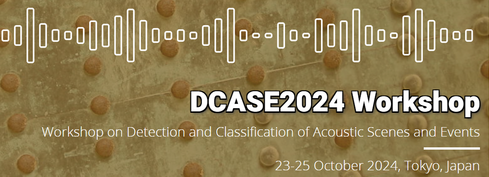

# DCASE-2024-Workshop Papers

The 9th Workshop on Detection and Classification of Acoustic Scenes and Events, DCASE 2024, will take place in Tokyo, Japan on 23-25 October.

## Papers
<i> Not yet available </i>

## Challenge Tasks

| **ID** | **Category** | **Task**    |       **Baselines**             |    **Proposed Model(s)**    |                                                                                                       
|:------:|:------------:|-----------------|:---------------------------:|:---------------------------:|
| 1 | Scenes | Data-Efficient Low-Complexity Acoustic Scene Classification | | |
| 2 | Monitoring | First-Shot Unsupervised Anomalous Sound Detection for Machine Condition Monitoring | | |
| 3 | Localization | Audio and audiovisual sound event localization and detection with source distance estimation | | |
| 4 | Events | Sound event detection with heterogeneous training dataset and potentially missing labels | | |
| 5 | Bio | Few-shot Bioacoustic Event Detection | | |
| 6 | Caption | Automated Audio Captioning | | |
| 7 | Synthesis | Sound Scene Synthesis | | |
| 8 | Retrieval | Language-Based Audio Retrieval | | |
| 9 | Separation | Language-Queried Audio Source Separation | | |
| 10| Monitoring | Acoustic-based traffic monitoring | | |

## Datasets

<i> Not yet available </i>