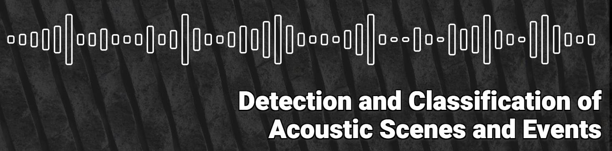

# DCASE-2023-Workshop Papers

A collection of [DCASE 2023 Workshop on Detection and Classification of Acoustic Scenes and Events](https://trepo.tuni.fi/bitstream/handle/10024/152310/978-952-03-3171-9.pdf?sequence=2&isAllowed=y) papers and other material. 

<!--

-->

The upcoming DCASE workshop is scheduled for October 23-25, 2024 in Tokyo, Japan. More information <a href="https://dcase.community/workshop2024/">here</a>

## Contribute
Contributions are welcome!

## Papers

| **ID** | **Title** | **Repo** | **PDF** | **Abstract**                                                                                                                                                                                                                                                                                                                                                                                                                                                                                                                                                                                                                                                                                                                                                                                                                                                                                                                                                                                                                                                                                                                                                                                                   |
| ------ | ----------| :------: |:-------:|----------------------------------------------------------------------------------------------------------------------------------------------------------------------------------------------------------------------------------------------------------------------------------------------------------------------------------------------------------------------------------------------------------------------------------------------------------------------------------------------------------------------------------------------------------------------------------------------------------------------------------------------------------------------------------------------------------------------------------------------------------------------------------------------------------------------------------------------------------------------------------------------------------------------------------------------------------------------------------------------------------------------------------------------------------------------------------------------------------------------------------------------------------------------------------------------------------------| 
| 1 | Sound Event Classification with Object-Based Labels | :heavy_minus_sign: |  | 

Show
 
 Availability of audio-visual datasets and increase of computational resources have made possible the use of deep learning techniques that exploit the relationship between audio and video. In this paper, we present an approach that makes use of pretrained models for object detection to label audio clips based on objects that are expected to make sound. The study consists of performing object detection for four target classes belonging to vehicle category and training sound classifiers in supervised way using the resulting labels. We conclude that object detection is a useful alternative for labeling audio-visual material for audio classification, with substantial improvements in different datasets. Results show that even for data provided with reference audio labels, labeling through video object detection can identify additional, non-annotated acoustic events, thus improving the quality of the labels in existing datasets. This promotes exploitation of video content not only as an alternative, but also to complement the available label information.

 |
| 2 | Learning in the Wild: Bioacoustics Few Shot Learning Without Using a Training Set | :heavy_minus_sign: |  | 

Show
 
 Few-shot learning is a machine learning approach in which a pre-trained model is re-trained for new categories with just a few examples. This strategy results very convenient for problems with a dynamic number of categories as typically happens in acoustic data. The purpose of this paper is to explore the possibility of skipping this pre-training process and using as training data only the five first shots of an audio file together with the silence between them. For the experimental evaluation, data belonging to the Validation set of Task 5 DCASE Challenge 2023 is used, purposely neglecting the Training set. This challenge consists of detecting animal species using only five positive examples. In this exploratory work, three learning methods have been compared: a ResNet architecture with a prototypical loss, a ProtoNet and an XGBoost classifier. In all cases, spectrograms with different transformations are used as inputs. Obtained results are evaluated per audio file, enabling the obtention of particular conclusions about different animal species. While the detection for some species presents encouraging results using only these first 5-shots as training data, all the tested algorithms are unable to successfully learn how to properly detect the blackbird sounds of the validation dataset.

 |
| 3 | Multi-Resolution Conformer for Sound Event Detection: Analysis and Optimization | :heavy_minus_sign: |  | 

Show
 
 The Conformer architecture has achieved state-of-the-art results in several tasks, including automatic speech recognition and automatic speaker verification. However, its utilization in sound event detection and in particular in the DCASE Challenge Task 4 has been limited despite winning the 2020 edition. Although the Conformer architecture may not excel in accurately localizing sound events, it shows promising potential in minimizing confusion between different classes. Therefore, in this paper we propose a Conformer optimization to enhance the second Polyphonic Sound Detection Score (PSDS) scenario defined for the DCASE 2023 Task 4A. With the aim of maximizing its classification properties, we have employed recently proposed methods such as Frequency Dynamic Convolutions in addition to our multi-resolution approach, which allow us to analyse its behaviour over different time-frequency resolution points. Furthermore, our Conformer systems are compared with multi-resolution models based on Convolutional Recurrent Neural Networks (CRNNs) to evaluate the respective benefits of each architecture in relation to the two proposed scenarios for the PSDS and the different time-frequency resolution points defined. These systems were submitted as our participation in the DCASE 2023 Task 4A, in which our Conformer system obtained a PSDS2 value of 0.728, achieving one of the highest scores for this scenario among systems trained without external resources.

 |
| 4 | Foley Sound Synthesis at the DCASE 2023 Challenge | :heavy_minus_sign: |  | 

Show
 
The addition of Foley sound effects during post-production is a common technique used to enhance the perceived acoustic properties of multimedia content. Traditionally, Foley sound has been produced by human Foley artists, which involves manual recording and mixing of sound. However, recent advances in sound synthesis and generative models have generated interest in machine-assisted or automatic Foley synthesis techniques. To promote further research in this area, we have organized a challenge in DCASE 2023: Task 7 - Foley Sound Synthesis. Our challenge aims to provide a standardized evaluation framework that is both rigorous and efficient, allowing for the evaluation of different Foley synthesis systems. We received 17 submissions, and performed both objective and subjective evaluation to rank them according to three criteria: audio quality, fit-to-category, and diversity. Through this challenge, we hope to encourage active participation from the research community and advance the state-of-the-art in automatic Foley synthesis. In this paper, we provide a detailed overview of the Foley sound synthesis challenge, including task definition, dataset, baseline, evaluation scheme and criteria, challenge result, and discussion.

 |
| 5 | STELIN-US: A Spatio-Temporally Linked Neighborhood Urban Sound Database |   |  | 

Show
 
Automated acoustic understanding, e.g., sound event detection and acoustic scene recognition, is an important research direction enabling numerous modern technologies. Although there is a wealth of corpora, most, if not all, include acoustic samples of scenes/events in isolation without considering their inter-connectivity with locations nearby in a neighborhood. Within a connected neighborhood, the temporal continuity and regional limitation (sound-location dependency) at distinct locations creates non-iid acoustics samples at each site across spatial-temporal dimensions. To our best knowledge, none of the previous data sources takes on this particular angle. In this work, we present a novel dataset, Spatio-temporally Linked Neighborhood Urban Sound (STeLiN-US) database. The dataset is semi-synthesized, that is, each sample is generated by leveraging diverse sets of real urban sounds with crawled information of real-world user behaviors over time. This method helps create realistic large-scale dataset, and we further evaluate through perceptual listening test. This neighborhood-based data generation opens up novel opportunities to advance user-centered applications with automated acoustic understanding. For example, to develop real-world technology to model a user's speech data over a day, one can imagine utilizing this dataset as user's speech samples would modulate by diverse sources of acoustics surrounding linked across sites and temporally by natural behavior dynamics at each location over time.

 |
| 6 | Foley Sound Synthesis Based on Generative Adversarial Networks Using Oneself-Conditioned Contrastive Learning | :heavy_minus_sign: |  | 

Show
 
The creation of sound effects, such as foley sounds, for radio or film has traditionally relied on the expertise of skilled professionals. However, synthesizing these sounds automatically without expert intervention presents significant challenge. Particularly, when the available data is limited, this challenge becomes even more compounded. This often leads to a lack of diversity in the generated data. In this paper, we propose effective GAN frameworks, O2C-GAN and OC-SupConGAN for foley sound synthesis in this situation. The proposed frameworks use a new learning method, oneself-conditioned contrastive learning (OCC learning), to solve problems encountered in small dataset. The OCC learning is a method that aims to expand the diversity of data while preserving the inherent attributes of each class within the data. Experiments show that the proposed framework outperforms baseline schemes, ranking 2nd in DCASE2023-T7 Track B with a FAD score of 5.023 on the evaluation set.

 |
| 7 | Description and Discussion on DCASE 2023 Challenge Task 2: First-Shot Unsupervised Anomalous Sound Detection for Machine Condition Monitoring | :heavy_minus_sign: |  | 

Show
 
We present the task description of the Detection and Classification of Acoustic Scenes and Events (DCASE) 2023 Challenge Task 2: “First-shot unsupervised anomalous sound detection (ASD) for machine condition monitoring”. The main goal is to enable rapid deployment of ASD systems for new kinds of machines without the need for hyperparameter tuning. In the past ASD tasks, developed methods tuned hyperparameters for each machine type, as the development and evaluation datasets had the same machine types. However, collecting normal and anomalous data as the development dataset can be infeasible in practice. In 2023 Task 2, we focus on solving first-shot problem, which is the challenge of training a model on a completely novel machine type. Specifically, (i) each machine type has only one section (a subset of machine type) and (ii) machine types in the development and evaluation datasets are completely different. Analysis of 86 submissions from 23 teams revealed that keys to outperform baselines were: 1) sampling techniques for dealing with class imbalances across different domains and attributes, 2) generation of synthetic samples for robust detection, and 3) use of multiple large pre-trained models to extract meaningful embeddings for the anomaly detector.

 |
| 8 | Post-Processing Independent Evaluation of Sound Event Detection Systems |  |  | 

Show
 
 Due to the high variation in the application requirements of sound event detection (SED) systems, it is not sufficient to evaluate systems only in a single operating mode. Therefore, the community recently adopted the polyphonic sound detection score (PSDS) as an evaluation metric, which is the normalized area under the PSD receiver operating characteristic (PSD-ROC). It summarizes the system performance over a range of operating modes resulting from varying the decision threshold that is used to translate the system output scores into a binary detection output. Hence, it provides a more complete picture of the overall system behavior and is less biased by specific threshold tuning. However, besides the decision threshold there is also the post-processing that can be changed to enter another operating mode. In this paper we propose the post-processing independent PSDS (piPSDS) as a generalization of the PSDS. Here, the post-processing independent PSD-ROC includes operating points from varying post-processings with varying decision thresholds. Thus, it summarizes even more operating modes of an SED system and allows for system comparison without the need of implementing a post-processing and without a bias due to different post-processings. While piPSDS can in principle combine different types of post-processing, we here, as a first step, present median filter independent PSDS (miPSDS) results for this year’s DCASE Challenge Task4a systems. Source code is publicly available in our sed_scores_eval package.

 |
| 9 | ToyADMOS2+: New Toyadmos Data and Benchmark Results of the First-Shot Anomalous Sound Event Detection Baseline | |  | 

Show
 
This paper introduces the newly recorded ToyADMOS dataset for the DCASE 2023 Challenge Task 2, First-shot anomalous sound detection for machine condition monitoring (DCASE2023T2). New machine types, such as ToyDrone, ToyNscale, Vacuum, and ToyTank, were newly recorded as a part of the Additional training and Evaluation datasets. This paper also shows benchmark results of the First-shot baseline implementation (with simple autoencoder and selective Mahalanobis modes) on the DCASE2023T2 Evaluation dataset and the previous DCASE Challenge Task 2 datasets in 2020, 2021, and 2022, compared with the baselines of those years.

 |
| 10 | Evaluating Classification Systems Against Soft Labels with Fuzzy Precision and Recall    | :heavy_minus_sign: |  | 

Show
 
Classification systems are normally trained by minimizing the cross-entropy between system outputs and reference labels, which makes the Kullback-Leibler divergence a natural choice for measuring how closely the system can follow the data. Precision and recall provide another perspective for measuring the performance of a classification system. Non-binary references can arise from various sources, and it is often beneficial to use the soft labels for training instead of the binarized data. However, the existing definitions for precision and recall require binary reference labels, and binarizing the data can cause erroneous interpretations. We present a novel method to calculate precision, recall and F-score without quantizing the data. The proposed metrics extend the well established metrics as the definitions coincide when used with binary labels. To understand the behavior of the metrics we show simple example cases and an evaluation of different sound event detection models trained on real data with soft labels.

 |
| 11 | META-SELD: Meta-Learning for Fast Adaptation to the New Environment in Sound Event Localization and Detection | :heavy_minus_sign: |  | 

Show
 
For learning-based sound event localization and detection (SELD) methods, different acoustic environments in training and test sets may result in large performance differences in validation and evaluation stages. Different environments, such as different sizes of rooms, different reverberation times, and different background noise, may be the reason for a learning-based system to fail. On the other hand, acquiring annotated spatial sound event samples, which include onset and offset time stamps, class types of sound events, and direction-of-arrival (DOA) of sound sources is very expensive. In addition, deploying a SELD system in a new environment often poses challenges due to time-consuming training and fine-tuning processes. To address these issues, we propose Meta-SELD, which applies meta-learning methods to achieve fast adaptation to new environments. More specifically, based on Model Agnostic Meta-Learning (MAML), the proposed Meta-SELD aims at finding good meta-initialized parameters to adapt to new environments only with a small number of samples and parameter updating iterations. We can then adapt the meta-trained SELD model to unseen environments quickly. Our experiments compare fine-tuning methods from pre-trained SELD models with our Meta-SELD on Sony-TAU Realistic Spatial Soundscapes 2023 (STARSSS23) dataset. The evaluation results demonstrate the effectiveness of Meta-SELD adapting to new environments.

 |
| 12 | Leveraging Geometrical Acoustic Simulations of Spatial Room Impulse Responses for Improved Sound Event Detection and Localization |  |  | 

Show
 
As deeper and more complex models are developed for the task of sound event localization and detection (SELD), the demand for annotated spatial audio data continues to increase. Annotating field recordings with 360^{\circ} video takes many hours from trained annotators, while recording events within motion-tracked laboratories are bounded by cost and expertise. Because of this, localization models rely on a relatively limited amount of spatial audio data in the form of spatial room impulse response (SRIR) datasets, which limits the progress of increasingly deep neural network based approaches. In this work, we demonstrate that simulated geometrical acoustics can provide an appealing solution to this problem. We use simulated geometrical acoustics to generate a novel SRIR dataset that can train a SELD model to provide similar performance to that of a real SRIR dataset. Furthermore, we demonstrate using simulated data to augment existing datasets, improving on benchmarks set by state of the art SELD models. We explore the potential and limitations of geometric acoustic simulation for localization and event detection. We also propose further studies to verify the limitations of this method, as well as further methods to generate synthetic data for SELD tasks without the need to record more data.

 |
| 13 | Speech Obfuscation in Mel Spectra That Allows for Centralised Annotation and Classification of Sound Events | :heavy_minus_sign: |  | 

Show
 
Nowadays, computerised Sound Event Classification (SEC) aids in several applications, e.g. monitoring domestic events in smart homes. SEC model development typically requires data collected from a diverse set of remote locations. However, this data could disclose sensitive information about uttered speech that might have been present during the acquisition. This makes automated data acquisition at remote locations difficult in practice. In this work, three data preprocessing techniques are investigated that obstruct recognising semantics in speech, but retain the required information in the data for annotating sound events and SEC model development. At the remote location, the data are first preprocessed before transferring to a central place. At the central location, speech should not be interpretable anymore, while still having the opportunity to annotate data with relevant sound event labels. For this purpose, starting from a log-mel representation of the sound signals, three speech obfuscation techniques are assessed: 1) calculating a moving average of the log-mel spectra, 2) sampling a few of the most energetic log-mel spectra and 3) shredding the log-mel spectra. Both intelligibility and SEC experiments were carried out.

 |
| 14 | FALL-E: A Foley Sound Synthesis Model and Strategies | :heavy_minus_sign: |  | 

Show
 
This paper introduces FALL-E, a foley synthesis system and its training/inference strategies. The FALL-E model employs a cascaded approach comprising low-resolution spectrogram generation, spectrogram super-resolution, and a vocoder. We trained every sound-related model from scratch using our extensive datasets, and utilized a pre-trained language model. We conditioned the model with dataset-specific texts, enabling it to learn sound quality and recording environment based on text input. Moreover, we leveraged external language models to improve text descriptions of our datasets and performed prompt engineering for quality, coherence, and diversity. FALL-E was evaluated by an objective measure as well as listening tests in the DCASE 2023 challenge Task 7. The submission achieved the second place on average, while achieving the best score for diversity, second place for audio quality, and third place for class fitness.

 |
| 15 | Label Filtering-Based Self-Learning for Sound Event Detection Using Frequency Dynamic Convolution with Large Kernel Attention | :heavy_minus_sign: |  | 

Show
 
This paper proposes a convolutional recurrent neural network (CRNN)-based sound event detection (SED) model. The proposed model utilizes frequency dynamic convolution (FDY) with a large kernel attention (LKA) for convolution operations within the CRNN. This is designed to effectively capture time-frequency patterns and long-term dependencies for non-stationary audio events. In addition, we concatenate a pre-trained bidirectional encoder representation from audio transformers (BEATs) embedding with the output of FDY–LKA. This provides the FDY-based feature maps with semantic information. Given the limited labeled data condition of the DCASE Challenge dataset, we first employ the mean-teacher-based semi-supervised learning. Then, we propose label filtering-based self-learning for audio event data selection, when their pseudo labels predicted from the mean-teacher model are strong correlated with given weakly labels. This strategy applies weakly labeled and unlabeled data, and then extends to the AudioSet. We evaluate its performance of the proposed SED model on DCASE 2023 Challenge Task 4A, measuring the F1-score and polyphonic sound detection scores, namely PSDS1 and PSDS2. The results indicate that the proposed CRNN-based model with FDY–LKA improves the F1-score, PSDS1, and PSDS2 in comparison to the baseline for DCASE 2023 Challenge Task 4A. When we apply the BEATs embedding via average pooling to both the baseline and the proposed model, we find that the performance of the proposed model significantly outperforms the baseline, with an F1-score of 6.2%, a PSDS1 score of 0.055, and a PSDS2 score of 0.021. Consequently, our model is ranked first in the DCASE 2023 Challenge Task 4A evaluation for a single model track, and second for an ensemble model.

 |
| 16 | Improving Automated Audio Captioning Fluency Through Data Augmentation and Ensemble Selection |  :heavy_minus_sign: |  | 

Show
 
Automated audio captioning is a task of generating descriptions corresponding to audio clips. The model typically consists of a pre-training and fine-tuning process, with additional utilization of reinforcement learning techniques. While reinforcement learning enhances the evaluation metrics for captions, it has the drawback of potentially lowering the quality of the captions, such as incomplete sentence structures or repetitive words. In this study, we propose an ensemble selection technique that combines models before and after reinforcement learning to improve evaluation metrics while maintaining caption quality. Furthermore, we apply several data augmentation techniques to complement the characteristics of WavCaps, which predominantly consists of single events, and enhance the model's generalization abilities. In particular, proposed approaches can reach impressive scores both an existing metric SPIDE_{r}, and a new fluency metric SPIDE_{r}-FL, 0.344 and 0.315, respectively. This resulted in a 2nd place ranking in DCASE 2023 task 6a, while the baseline system achieved SPIDE_{r} of 0.271 and SPIDE_{r}-FL of 0.264.

 |
| 17 | Weakly-Supervised Automated Audio Captioning via Text Only Training |   |  | 

Show
 
In recent years, datasets of paired audio and captions have enabled remarkable success in automatically generating descriptions for audio clips, namely Automated Audio Captioning (AAC). However, it is labor-intensive and time-consuming to collect a sufficient number of paired audio and captions. Motivated by the recent advances in Contrastive Language-Audio Pretraining (CLAP), we propose a weakly-supervised approach to train an AAC model assuming only text data and a pre-trained CLAP model, alleviating the need for paired target data. Our approach leverages the similarity between audio and text embeddings in CLAP. During training, we learn to reconstruct the text from the CLAP text embedding, and during inference, we decode using the audio embeddings. To mitigate the modality gap between the audio and text embeddings we employ strategies to bridge the gap during training and inference stages. We evaluate our proposed method on Clotho and AudioCaps datasets demonstrating its ability to achieve up to ~83% of the performance attained by fully supervised approaches trained on paired target data.

 |
| 18 | Killing Two Birds with One Stone: Can an Audio Captioning System Also Be Used for Audio-Text Retrieval? |  :heavy_minus_sign: |  | 

Show
 
Automated Audio Captioning (AAC) aims to develop systems capable of describing an audio recording using a textual sentence. In contrast, Audio-Text Retrieval (ATR) systems seek to find the best matching audio recording(s) for a given textual query (Text-to-Audio) or vice versa (Audio-to-Text). These tasks require different types of systems: AAC employs a sequence-to-sequence model, while ATR utilizes a ranking model that compares audio and text representations within a shared projection subspace. However, this work investigates the relationship between AAC and ATR by exploring the ATR capabilities of an unmodified AAC system, without fine-tuning for the new task. Our AAC system consists of an audio encoder (ConvNeXt-Tiny) trained on AudioSet for audio tagging, and a transformer decoder responsible for generating sentences. For AAC, it achieves a high SPIDEr-FL score of 0.298 on Clotho and 0.472 on AudioCaps on average. For ATR, we propose using the standard Cross-Entropy loss values obtained for any audio/caption pair. Experimental results on the Clotho and AudioCaps datasets demonstrate decent recall values using this simple approach. For instance, we obtained a Text-to-Audio R@1 value of 0.382 for AudioCaps, which is above the current state-of-the-art method without external data. Interestingly, we observe that normalizing the loss values was necessary for Audio-to-Text retrieval.

 |
| 19 | Few Shot Bioacoustic Detection Boosting with Finetuning Strategy Using Negative-Based Prototypical Learning | :heavy_minus_sign: |  | 

Show
 
Sound event detection involves the identification and temporal localization of sound events within audio recordings. Bioacoustic sound event detection specifically targets animal vocalizations, which necessitate substantial time and resources for manual annotation of temporal boundaries. This paper aims to address the challenges associated with bioacoustic sound event detection by proposing a novel prototypical learning framework. Our approach fuses contrastive learning and prototypical learning to use the limited amount of dataset at its utmost. Further, our framework leverages finetuning strategy with a novel loss function to develop a robust framework. Experimental results on a benchmark dataset demonstrate the effectiveness of our proposed method in accurately detecting and localizing bioacoustic sound events, improving the F1 score from 29.59% to 83.08%.

 |
| 20 | Masked Modeling Duo Vision Transformer with Multi-Layer Feature Fusion on Respiratory Sound Classification |   |  | 

Show
 
Respiratory sounds are significant relevant indicators for respi- ratory health and conditions. Classifying the respiratory sounds of patients can assist doctors’ diagnosis of lung diseases. For this pur- pose, many deep learning-based automatic analysis methods have been developed. However, it is still challenging due to the lim- ited medical sound datasets. In this study, we apply a pre-trained Vision Transformer (ViT) based model from the Masked Model- ing Duo (M2D) framework for this task. While the M2D ViT pre- trained model provides effective features, we think combining fea- tures from different layers can improve the performance in this task. We propose a multi-layer feature fusion method using learnable layer-wise weights and validate its effectiveness in experiments and an analysis of pre-trained model layers. Our approach achieves the best ICBHI score of 60.68, 2.39 higher than the previous state-of- the-art method.

 |
| 21 | Efficient Evaluation Algorithms for Sound Event Detection | :heavy_minus_sign: |  | 

Show
 
The prediction of a sound event detection (SED) system may be represented on a timeline by intervals whose bounds correspond to onset and offset respectively. In this context, SED evaluation requires to find all non-empty intersections between predicted and reference intervals. Denoting by M and N the number of predicted events and reference events, the time complexity of exhaustive search is O(MN). This is particularly inefficient when the acoustic scene of interest contains many events (typically above 10^3) or when the detection threshold is low. Our article presents an algorithm for pairwise intersection of intervals by performing binary search within sorted onset and offset times. Computational benchmarks on the BirdVox-full-night dataset confirms that our algorithm is significantly faster than exhaustive search. Moreover, we explain how to use this list of intersecting prediction--reference pairs for the purpose of SED evaluation: the Hopcroft-Karp algorithm guarantees an optimal bipartite matching in time O((M+N)^{3/2}) in the best case (all events are pairwise disjoint) and O((M+N)^{5/2}) in the worst case (all events overlap with each other). The solution found by Hopcroft-Karp unambiguously defines a number of true positives, false positives, and false negatives; and ultimately, information retrieval metrics such as precision, recall, and F-score.

 |
| 22 | Aggregate or Separate: Learning From Multi-Annotator Noisy Labels for Best Classification Performance | |
| 23 | Active Learning in Sound-Based Bearing Fault Detection | |
| 24 | Auditory Neural Response Inspired Sound Event Detection Based on Spectro-Temporal Receptive Field | |
| 25 | Creating a Good Teacher for Knowledge Distillation in Acoustic Scene Classification | |
| 26 | Pretraining Representations for Bioacoustic Few-Shot Detection Using Supervised Contrastive Learning | |
| 27 | Incremental Learning of Acoustic Scenes and Sound Events | |
| 28 | Frequency & Channel Attention for Computationally Efficient Sound Event Detection | |
| 29 | Unsupervised Domain Adaptation for the Cross-Dataset Detection of Humpback Whale Calls | |
| 30 | Few-Shot Bioacoustic Event Detection at the DCASE 2023 Challenge | |
| 31 | Advancing Natural-Language Based Audio Retrieval with Passt and Large Audio-Caption Data Sets | |
| 32 | Foley Sound Synthesis with a Class-Conditioned Latent Diffusion Model | |
| 33 | Distilling the Knowledge of Transformers and CNNs with CP-Mobile | |
| 34 | Device Generalization with Inverse Contrastive Loss and Impulse Response Augmentation | |
| 35 | Multi-Label Open-Set Audio Classification | |
| 36 | Spectral Transcoder : Using Pretrained Urban Sound Classifiers on Undersampled Spectral Representations | |
| 37 | Audio Difference Captioning Utilizing Similarity-Discrepancy Disentanglement | |
| 39 | Cross-Dimensional Interaction with Inverted Residual Triplet Attention for Low-Complexity Sound Event Detection | |
| 40 | Exploring Multi-Task Learning with Weighted Soft Label Loss for Sound Event Detection with Soft Labels | |
| 41 | Event Classification with Class-Level Gated Unit Using Large-Scale Pretrained Model for Optical Fiber Sensing | |
| 42 | Audio-Change Captioning to Explain Machine-Sound Anomalies | |
| 43 | Automatic Detection of Cow Vocalizations Using Convolutional Neural Networks | |
| 44 | Low-Complexity Acoustic Scene Classification Using Deep Mutual Learning and Knowledge Distillation Fine-Tuning | |
| 45 | Two vs. Four-Channel Sound Event Localization and Detection | | 
| 46 | PLDISET: Probabilistic Localization and Detection of Independent Sound Events with Transformers | |
| 47 | Crowdsourcing and Evaluating Text-Based Audio Retrieval Relevances | |
| 48 | Text-Driven Foley Sound Generation with Latent Diffusion Model | |

##  Videos

<i>coming soon </i>

## Tasks
| **ID** | **Category** | **Task**                                                                                                 | 
|:------:|:------------:|----------------------------------------------------------------------------------------------------------|
|   1    |    Scene     | Low-Complexity Acoustic Scene Classification                                                             |
|   2    |  Monitoring  | First-Shot Unsupervised Anomalous Sound Detection for Machine Condition Monitoring                       |
|   3    | Localization | Sound Event Localization and Detection Evaluated in Real Spatial Sound Scenes                            |
|   4    |    Events    | Sound Event Detection with Weak Labels and Synthetic Soundscapes; Sound Event Detection with Soft Labels |
|   5    |     Bio      | Few-shot Bioacoustic Event Detection                                                                     |
|   6    |   Caption    | Automated Audio Captioning and Language-Based Audio Retrieval                                            |
|   7    |  Synthesis   | Foley Sound Synthesis                                                                                    |

## Datasets

| **ID** | **Title**                              | **Tasks** | **Year** |                                                 **Repo**                                                  |
|:------:|----------------------------------------|:---------:|:--------:|:---------------------------------------------------------------------------------------------------------:|
|   1    | TAU Urban Acoustic Scenes 2022 Mobile, Development dataset | 1 |   2022   |  |
|   2    | TAU Urban Acoustic Scenes 2023 Mobile, Evaluation dataset | 1 |   2023   |  |
|   3    | STeLiN-US: A Spatio-Temporally Linked Neighborhood Urban Sound Database |    1,4    |   2023   |  |
|   4    |      DCASE 2023 Evaluation dataset     |     2     |   2023   |  |
|   5    | DCASE 2023 Additional Training dataset |     2     |   2023   |  |
|   6    |   DESED    |     4     |   2020   |        |
|   7    | DCASE 2023 |     7     |   2023   |  |
